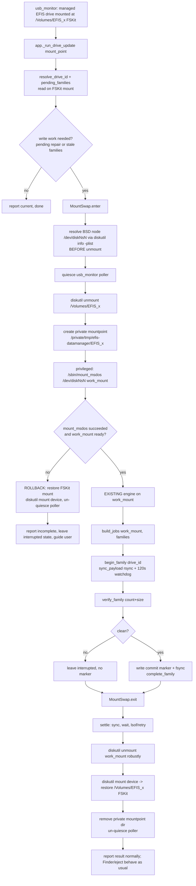

# Design Document

## Overview

The EFIS Data Manager menu-bar tool syncs GRT chart data to a physical FAT32 USB
drive. Heavy write sessions (a from-scratch full populate of ~101,563 files /
9.1 GB, or a substantial incremental top-up) reliably stall: write progress
stops for 120 seconds, the existing no-progress watchdog aborts the affected
family, the drive is left partially synced, and the persisted "interrupted"
sync-state guarantees every reinsert re-attempts and re-stalls the same write.
The result is a chart drive that can never complete a sync.

This design adopts a single primary mitigation — **mount the drive via
`/sbin/mount_msdos` for the duration of chart writes instead of using the
default FSKit mount** — and slots it in as a thin *mount-swap* layer
*underneath* the existing, unchanged sync engine (`build_jobs` →
`sync_payload` → `verify_family` → commit marker). The sync engine keeps
operating exactly as today; it simply receives a different `mount_point` (a
private msdos mountpoint) during the write window.

### Root cause: CONFIRMED (upgrade from the requirements' "hypothesis" framing)

The requirements deliberately framed the FSKit driver as a *working hypothesis,
not established fact*, and required confirmation before committing a mitigation.
**A spike was run this session and the FSKit root cause is now CONFIRMED, and
the `mount_msdos` mitigation is VALIDATED.** The design treats the following
spike results as established fact:

- **Environment:** macOS 15.7.9 (build 24G830). Drive `EFIS_3` = `/dev/disk4s1`,
  FAT32.
- **Baseline mount is FSKit.** The default mount reports:
  `/dev/disk4s1 on /Volumes/EFIS_3 (msdos, local, noatime, fskit)`, and the only
  filesystem kext loaded is `com.apple.filesystems.lifs`.
- **`mount_msdos` bypasses FSKit.** Running
  `/sbin/mount_msdos /dev/disk4s1 /tmp/efis3_msdos` triggered
  `kmutil load -p /System/Library/Extensions/msdosfs.kext` and loaded the
  **classic in-kernel kext `com.apple.filesystems.msdosfs (1.10)`** alongside
  `lifs`. The resulting mount carried **no fskit flag**:
  `(msdos, local, noowners)`. This is direct evidence that `mount_msdos` routes
  through the legacy in-kernel msdosfs driver, not the FSKit `lifs` path, on
  15.7.9 — refuting the requirements' concern that `msdos.fs` being an FSKit
  module might route `mount_msdos` through the same stalling path (Req 3.1).
- **Heavy write under `mount_msdos` does not stall.** Copying 6,000 real
  approach-plate files to the drive under the `mount_msdos` mount completed with
  **zero stalls** (never approached the no-progress threshold). The **same
  drive, files, and machine reliably stall** (120s no-progress) under the
  default FSKit mount (Req 3.2).

**Conclusions (authoritative):**

- **(Req 2) The FSKit `msdos` / `lifs` path is CONFIRMED as the stall root
  cause.** The evidence is the msdosfs-kext-load observation plus the
  zero-stall heavy write under the non-FSKit mount, contrasted against reliable
  stalls under FSKit on identical inputs.
- **(Req 3) `mount_msdos` is CONFIRMED VIABLE and is the adopted primary
  mitigation.**
- **(Req 4) The throttle/chunk and remount-on-stall fallbacks become
  contingencies, not the primary path.** They are documented here as designed
  contingencies to enable should `mount_msdos` ever fail on some future
  machine/drive, but they are not built as the default flow.

### Spike teardown hiccup to design around

During spike teardown, `umount /tmp/efis3_msdos` returned **"Resource busy"**;
recovery required `diskutil unmount` followed by `diskutil mount`. The design
therefore treats robust teardown as a first-class concern: settle, retry, prefer
`diskutil unmount` over raw `umount`, and never leave the drive unmounted or on
a stale mountpoint (see [Device-node & mountpoint management](#device-node--mountpoint-management)
and [Error Handling](#error-handling-and-rollback)).

### Scope

This remains a **menu-bar-tool-only change** (Req 8.1). No Apple driver is
patched. The existing `drive-sync-integrity` machinery (resumable sync-state,
count+size verification, commit markers, metadata exclusion, stdout draining,
120s watchdog) is reused **as-is** and is not redesigned (Non-Goals). Per the
versioning policy this is a menu-bar change: **bump `MENUBAR_VERSION`; leave
`DASHBOARD_VERSION` unchanged** (Req 8.2, 8.3).

---

## Architecture

### Where the mount-swap layer lives

Today, `app._run_drive_update(mount_point)` orchestrates the whole update for a
managed drive: `resolve_drive_id` → `pending_families` (verify+repair) →
`check_drive_currency` → `update_drive(mount_point, families=stale, ...)`. Every
step keys off a `mount_point` under `/Volumes/`.

The mitigation introduces a **mount-swap context** that wraps the *write window*
only. Conceptually:

```
mount_point (/Volumes/EFIS_3, FSKit)   <- what usb_monitor/app see normally
        │
        ▼
  MountSwap.enter()  ── resolve /dev/diskNsN + drive_id, quiesce poller,
        │                diskutil unmount FSKit, mount_msdos at private point
        ▼
  work_mount (/private/tmp/efis-datamanager/EFIS_3, in-kernel msdosfs)
        │
        ▼
  EXISTING engine runs against work_mount:
     build_jobs(work_mount, families) -> sync_payload -> verify_family -> marker
        │
        ▼
  MountSwap.exit()  ── unmount msdos robustly (settle/retry/diskutil),
                       restore FSKit mount at /Volumes/, re-enable poller
```

The sync engine does not know or care that the mountpoint changed; it just
receives `work_mount` in place of `mount_point`. This keeps the mitigation a
strictly additive layer and honors "ONLY the mount underneath the rsync writes
changes."

### Component responsibilities

- **`mount_swap` (new module, e.g. `mount_swap.py`)** — owns the device-node
  resolution, unmount/remount lifecycle, mountpoint management, poller
  quiescing, and robust teardown/rollback. Exposes a context manager
  `msdos_mount(mount_point) -> work_mount`. All privileged calls funnel through
  a single **privileged-command shim** (see [The Privilege Problem](#the-privilege-problem-critical)).
- **`drive_updater` (unchanged)** — `build_jobs`, `sync_payload`,
  `verify_family`, commit-marker write, sync-state, drive identity. Receives
  whichever mountpoint it is handed.
- **`app` (small change)** — `_run_drive_update` wraps the *update* and
  *verify+repair* write windows in the `mount_swap` context. Currency checks
  and identity resolution that read a file or two can run either against the
  normal FSKit mount before the swap, or against `work_mount` inside it (see
  [Preserving correctness](#preserving-existing-correctness-guarantees) for
  which reads move inside the swap).
- **`usb_monitor` (small change)** — gains a *quiesce* switch so the 2-second
  `/Volumes/` poller does not race the swap by re-firing mount/unmount events or
  auto-actioning the transient disappearance/reappearance of the volume.

### End-to-end flow (Mermaid)



*Maps to Req 3 (adopted mitigation), Req 5 (heavy syncs complete), Req 6
(correctness preserved), Req 7 (safe UX on failure), Req 8 (scope).*

---

## Components and Interfaces

### `mount_swap` module

```
# Context manager: swaps a managed FSKit mount to an in-kernel msdosfs mount
# for the write window, then restores it. Yields the private work mountpoint.
@contextmanager
def msdos_mount(fskit_mount_point: str) -> Iterator[str]: ...

# Resolve the BSD device node (e.g. /dev/disk4s1) from a mount path, BEFORE
# unmounting, via `diskutil info -plist` (DeviceNode / BSD name key). Returns
# None on any failure (caller then aborts the swap and stays on FSKit).
def resolve_device_node(mount_point: str) -> Optional[str]: ...

# Choose/create the private mountpoint for a given volume label.
def private_mountpoint(label: str) -> str: ...

# Robust teardown of an msdos mountpoint (settle, retry, diskutil unmount,
# lsof-guided retry). Returns True once fully unmounted.
def robust_unmount(work_mount: str, device_node: str) -> bool: ...

# Restore the normal FSKit mount so Finder/eject behave normally afterward.
def restore_fskit_mount(device_node: str) -> bool: ...
```

The privileged operations (`mount_msdos`, `umount`/`diskutil unmount`, and
`diskutil mount` when a manual remount is required) are not called directly.
They are routed through:

```
# Single choke point for every privileged call. Whichever privilege mechanism
# is chosen (see The Privilege Problem), it is implemented ONCE here so the rest
# of the code is privilege-mechanism-agnostic and testable with a mock.
def run_privileged(argv: list[str], timeout: float) -> subprocess.CompletedProcess: ...
```

### `usb_monitor` change

Add a quiesce flag consulted at the top of `_poll_loop` and by the mount/eject
callbacks:

```
def pause(self) -> None: ...   # stop reacting to /Volumes/ churn
def resume(self) -> None: ...  # re-scan current state, adopt as the new baseline
```

`pause()` is called in `MountSwap.enter()` before the FSKit unmount; `resume()`
in `MountSwap.exit()` after the FSKit mount is restored. On `resume()` the
monitor re-reads `/Volumes/` and treats the restored mount as the *existing*
baseline (not a new mount event) so it does not re-trigger an auto-sync.

### `app._run_drive_update` change

The only orchestration change: wrap the write windows (the verify+repair branch
and the `update_drive` branch) so the engine runs against `work_mount`:

```
with msdos_mount(mount_point) as work_mount:
    # verify+repair (pending families) and/or update_drive run against work_mount
    ...
# outside the context, the FSKit mount is restored; currency reporting to the
# user proceeds exactly as today.
```

If `msdos_mount` cannot establish the swap, it restores the FSKit mount and
raises a typed error; `_run_drive_update` catches it, reports the sync
incomplete, leaves interrupted state intact, and (Req 7) surfaces guidance.

---

## Data Models

No new persisted schema. The mitigation reuses existing state unchanged:

- **Durable sync-state** (`~/EFIS/DataManagerLogs/.sync_state.json`, v2 id-keyed
  map) — keyed by durable `drive_id`, **not** by mount path. This is why the
  mount swap is safe: `begin_family`/`complete_family`/`pending_families` all
  key off the id resolved once from the drive's `EFIS_DRIVE_ID.json`, so
  changing the mountpoint mid-run never mis-attributes or loses state (Req 5.3,
  6.4).
- **Drive identity** (`EFIS_DRIVE_ID.json` at the volume root) — read/written on
  whatever mountpoint is active; the file travels with the volume regardless of
  mount path.
- **Commit markers** (`ChartData/ScannedCharts.sqlite`,
  `ChartData/Plates/Plates.sqlite`, and the nav files themselves) — written last,
  on `work_mount`, exactly as today.

Transient (in-memory, per swap) values only:

| Field | Meaning |
|---|---|
| `device_node` | e.g. `/dev/disk4s1`, resolved before unmount |
| `label` | volume label (e.g. `EFIS_3`), for the private mountpoint name |
| `work_mount` | e.g. `/private/tmp/efis-datamanager/EFIS_3` |
| `swap_state` | `entered` / `mounted` / `restored` — drives rollback |

---

## The Privilege Problem (CRITICAL)

`/sbin/mount_msdos`, `umount`, and `diskutil unmount`/`mount` of a volume the
user did not themselves mount **require root**. The app runs **as the user**: it
is installed by `install.sh` as a per-user LaunchAgent
(`~/Library/LaunchAgents/com.efisdatamanager.plist`, `RunAtLoad`), launched from
`/Applications/EFIS Data Manager.app`, executing the project venv's Python. It
has **no elevated rights today**. Any mitigation that unmounts/remounts must
acquire privilege somehow. This is the single biggest design risk, so the
options and tradeoffs are laid out explicitly and a recommendation is made — but
it is a **documented decision the user can veto**.

> Note on `diskutil`: `diskutil unmount`/`mount` of a *user-mounted removable
> volume* often succeeds without a prompt, but `mount_msdos` (mounting a raw
> device node at an arbitrary path) does **not** — it needs root. So even if the
> unmount side were free, the msdos remount side forces the privilege question.

### Option A — Privileged helper via `SMAppService`/launchd daemon (installed once)

A tiny, single-purpose privileged helper tool registered as a launchd **daemon**
(root), installed once (via `SMAppService.daemon` on modern macOS, or a
`LaunchDaemons` plist dropped by `install.sh` with a one-time admin prompt). The
unprivileged app talks to it over a local XPC/socket and asks it to perform
*exactly* the whitelisted operations: "unmount device X", "mount_msdos device X
at path Y", "restore FSKit mount of device X". The helper validates arguments
(device is a removable FAT32 volume, mountpoint is under the app's private dir)
and refuses anything else.

- **Install/UX:** one admin approval at install (or first use); silent
  thereafter — no per-sync password. Best ongoing UX by far.
- **Security blast radius:** smallest *at runtime* if the helper is narrowly
  scoped and validates inputs; largest *to build correctly* — a privileged
  daemon is a persistent root component and a real attack surface if the IPC or
  argument validation is sloppy.
- **Notarization/Gatekeeper:** highest bar. `SMAppService`/`SMJobBless`-style
  helpers must be **code-signed** (ideally with a Developer ID and notarized),
  with matching `SMAuthorizedClients`/`SMPrivilegedExecutables` designated
  requirements. This project currently ships **unsigned** (an ad-hoc
  `install.sh` that builds an unsigned `.app` bundle), so this option implies
  adopting signing/notarization — a substantial new prerequisite.
- **Fit with `install.sh`:** requires a real install step to place and bless the
  daemon; changes the installer from "copy files + load a LaunchAgent" to "also
  register a root helper."

### Option B — `AuthorizationServices` admin prompt (per session)

Use the Security framework `AuthorizationServices` to acquire an authorization
reference and run the mount/unmount commands with it. Prompts the user for admin
credentials via the native macOS dialog.

- **Install/UX:** no install-time change, but the user is prompted for admin
  credentials (typically once per app run, cacheable briefly). Prompting before
  every heavy sync is intrusive for an unattended menu-bar tool that is supposed
  to "just sync on insert."
- **Security blast radius:** moderate; the authorization is scoped to the
  session and the app still runs unprivileged between operations.
- **Notarization/Gatekeeper:** no signing requirement beyond what exists;
  `AuthorizationExecuteWithPrivileges` is deprecated, so this really means
  wiring the Security framework from Python (via `ctypes`/PyObjC), which is
  fiddly and easy to get subtly wrong.
- **Fit with `install.sh`:** none needed. But it undercuts the auto-on-insert
  model.

### Option C — Narrowly-scoped `sudoers` entry (NOPASSWD for exact commands)

`install.sh` drops a `/etc/sudoers.d/efis-data-manager` entry allowing the
install user to run *only* the exact commands with `NOPASSWD`:
`/sbin/mount_msdos`, `/usr/sbin/diskutil unmount`, `/usr/sbin/diskutil mount`,
scoped as tightly as sudoers syntax allows.

- **Install/UX:** one admin password at install (to write the sudoers file);
  silent, promptless mounts thereafter — matches the auto-on-insert model.
  Simplest to implement (the app just calls `sudo /sbin/mount_msdos ...`).
- **Security blast radius:** **this is the concern.** `mount_msdos` takes an
  arbitrary device and an arbitrary mountpoint; a `NOPASSWD` grant for it is
  broad — a local attacker could mount a crafted FAT image over a sensitive path
  as root. Sudoers cannot constrain arguments well (wildcards are permissive and
  historically footgun-prone). Mitigations: pin exact binary paths, avoid
  wildcards where possible, but the residual risk is real and hard to bound.
- **Notarization/Gatekeeper:** none. No signing needed.
- **Fit with `install.sh`:** clean — one more step writing a `sudoers.d` file
  behind the password the installer already collects for Homebrew.

### Option D — `osascript ... with administrator privileges` (per operation)

Wrap each privileged command in `osascript -e 'do shell script "..." with
administrator privileges'`.

- **Install/UX:** prompts for admin credentials via a GUI dialog, potentially
  on *every* privileged command. Noisy and easily mistaken for malware behavior
  by users.
- **Security blast radius:** the classic **shell-string-injection** hazard —
  building a shell command string from a device/path and handing it to
  `do shell script` is exactly the pattern to avoid. Also runs the whole command
  as root with a broad grant.
- **Notarization/Gatekeeper:** none required, but repeated auth prompts erode
  trust.
- **Fit with `install.sh`:** none needed, but the UX is the worst of the four
  and the injection surface is the most dangerous. **Not recommended.**

### Recommendation

**Recommended: Option A (a code-signed, narrowly-scoped privileged
`SMAppService`/launchd helper), with Option C (narrow `sudoers.d`) as the
pragmatic near-term fallback if signing/notarization is not yet in place.**

Rationale:

- The product is an **unattended, auto-on-insert** menu-bar tool. Any per-sync
  password prompt (Options B and D) defeats that model, so they are rejected for
  the normal path.
- Between the two promptless options, **A is the right long-term answer**: a
  purpose-built helper can *validate arguments* (only removable FAT32 devices,
  only mountpoints under the app's private directory), which `sudoers` for
  `mount_msdos` fundamentally cannot. That argument validation is what actually
  bounds the blast radius.
- **A's cost is real**: it requires adopting code signing + notarization and a
  proper helper install, which this project does not do today. If that cost is
  not acceptable now, **C ships the mitigation immediately** with a documented,
  accepted risk, and the codebase can migrate to A later *without touching the
  sync engine* because every privileged call already funnels through the single
  `run_privileged` shim.
- **D is rejected outright** (worst UX, shell-injection surface).

**This is a decision the user can veto.** If the user prefers to avoid a
persistent root helper *and* a broad sudoers grant, the acceptable fallback is
Option B (accept the per-run admin prompt) or to **decline the mount-swap
mitigation entirely and adopt the Req 4 fallback contingencies** (throttle/chunk
+ remount-on-stall), which need no elevated privilege for the write itself
(though the remount-on-stall variant still needs unmount/mount rights).

*Maps to Req 3 (adoption), Req 8.1 (menu-bar-tool scope; a helper is still part
of the tool's install, not an Apple driver change), and the security
considerations below.*

### Committed decision (user-approved) — Option A target, ship on Option C interim

The user has approved **Option A (signed `SMAppService` privileged helper) as the
committed target architecture**, delivered in **two phases** so a fully working
end-to-end sync is proven *before* committing to a paid Apple Developer ID:

- **Phase 1 (ship the fix now): interim Option C.** Implement the mount-swap on a
  narrowly-scoped `sudoers.d` grant so the stall is fixed and the *entire*
  workflow (unmount → `mount_msdos` → sync → verify → marker → restore) is
  validated on real drives. No signing, no Apple Developer account required. The
  broad-`mount_msdos`-grant risk is documented and explicitly accepted for this
  interim phase.
- **Phase 2 (migrate to Option A): signed helper.** Once Phase 1 proves a fully
  successful sync workflow, adopt a code-signed/notarized `SMAppService` helper
  with argument validation. Because every privileged call funnels through the
  single `run_privileged` shim, Phase 2 swaps only the shim's backend and the
  install path — **the sync engine and mount-swap logic do not change.**

Rationale (user): validate the real fix end-to-end before paying for a Developer
ID. This ordering de-risks the spend and keeps time-to-fix short. The task plan
reflects this: Phase-1 tasks deliver a working fix on the sudoers backend;
Phase-2 tasks (signing/notarization + signed helper) are separated and gated on
Phase-1 success, and are the point at which the Developer ID is acquired.

---

## Device-node & mountpoint management

### Resolving `/dev/diskNsN` reliably (BEFORE unmount)

The BSD device node **must** be captured *before* the FSKit unmount, because
once unmounted the mount path no longer resolves. Use `diskutil info -plist
<mount_point>` and read the BSD name / `DeviceNode` key (the same
`diskutil info -plist` call the codebase already uses for `VolumeUUID`,
`VolumeName`, and the eject parent-disk lookup). Parse with `plistlib`, tolerate
failure by returning `None`, and on `None` **abort the swap and stay on the
FSKit mount** rather than guessing a node. Cross-check the resolved node is a
removable, FAT32 slice before handing it to `mount_msdos`.

### Choosing/creating the private mountpoint

Mount at an app-owned path outside `/Volumes/` so the poller and Finder do not
treat it as a user volume, e.g.
`/private/tmp/efis-datamanager/<label>` (or under the app's log dir if a more
durable location is preferred). Create it `0700`, owned by the user. Naming it
by volume label keeps concurrent-drive scenarios distinct. The directory is
created in `enter()` and removed in `exit()` after unmount.

### Avoiding the "Resource busy" teardown failure

The spike's teardown failure (`umount` → "Resource busy", recovered via
`diskutil unmount` then `diskutil mount`) drives the teardown design:

1. **Settle first** — after the last write and marker fsync, `os.sync()` and a
   short wait so the in-kernel msdosfs driver flushes.
2. **Prefer `diskutil unmount`** over raw `/sbin/umount` — it is more robust at
   forcing a clean unmount and is what recovered the spike.
3. **Identify holders and retry** — if unmount reports busy, use `lsof
   +D <work_mount>` (or `lsof <work_mount>`) to find lingering handles (our own
   temp rsync logs are written to the system temp dir, not the mount, so the
   likely holders are transient), wait, and retry with bounded backoff.
4. **Bounded escalation** — after N retries, fall back to `diskutil unmount
   force` as a last resort, logged loudly.
5. **Never leave it dangling** — teardown always ends by attempting to restore
   the FSKit mount of the device (`diskutil mount <device_node>`) so the volume
   reappears under `/Volumes/` and Finder/eject behave normally. If restore
   fails, the user is told the drive needs reinsertion; the drive is **never**
   left silently unmounted (Req 7).

### Interaction with `usb_monitor` auto-mount

The 2-second `/Volumes/` poller would otherwise (a) see the FSKit volume vanish
during the swap and fire `on_efis_unmount`, then (b) see it reappear on restore
and fire `on_efis_mount` → auto-sync, racing the swap or triggering a redundant
sync. Prevent this by **quiescing the poller** (`pause()`) across the swap and
`resume()`-ing after restore, at which point the monitor rebaselines the
restored mount as pre-existing. macOS diskarbitration auto-mount is also a
concern: the drive is deliberately kept on our controlled `work_mount` during
the window, and we do not leave the device unmounted long enough for an
auto-mount to race in; if a stray `/Volumes/<label>` reappears, `enter()`
detects it and unmounts it before proceeding.

*Maps to Req 3, Req 5, Req 6.4, Req 7.*

---

## Preserving existing correctness guarantees

The whole point of the design is that **the write happens on `work_mount` but
nothing about the engine's correctness changes.** Concretely:

- **Stall watchdog (120s no-progress):** `sync_payload` still runs rsync with
  its stdout drained to temp files (avoiding the pipe-buffer deadlock) and still
  watches log-byte growth to abort after `STALL_TIMEOUT_SECONDS`. Under the
  adopted `mount_msdos` mount the spike shows it never trips; it remains armed as
  the contingency detector (Req 4.5, 7.1).
- **Resumable sync-state:** `begin_family` is still called *before* any copy and
  `complete_family` *only* after a clean verify + marker. Because state is keyed
  by durable `drive_id` (not mount path), the mountpoint change is invisible to
  it. An abort/failure on `work_mount` leaves the interrupted marker exactly as
  it would on the FSKit mount (Req 4.5, 5.3, 6.4).
- **Verification (count + size):** `verify_family` still walks the local image
  and the drive family tree — now rooted at `work_mount` — with the same
  exclude matching, before any marker is written (Req 6.1, 6.2).
- **Commit markers:** still copied + `fsync`ed + `os.sync()`ed as the atomic
  last step of each family, on `work_mount` (Req 6.2). Because unmount teardown
  additionally settles/syncs, the marker is durably on media before the drive
  returns to FSKit.
- **Metadata exclusion:** the same `--delete-excluded` + `COPYFILE_DISABLE=1` +
  `._*`/`.DS_Store` excludes apply unchanged (Req 6.5).
- **Idempotent no-op on re-run:** a second run over an already-current drive
  still finds every family current (markers present + verify clean) and does no
  write work — and therefore does not even need to perform the swap (Req 5.4,
  6.3).

The single integration fact that makes this work: **`build_jobs(work_mount,
families)`** simply points the payload roots and marker destinations at
`work_mount` during the write window; every downstream function already takes
the mountpoint as a parameter.

*Maps to Req 5.3, Req 6 (all), Req 4.5.*

---

## Instrumentation, reproduction, and acceptance harness

### Keep the root-cause determination reproducible (Req 2)

Even though the root cause is confirmed, the instrumentation is retained so the
determination stays reproducible and so a future macOS update that changes FSKit
behavior can be re-checked:

- Record app-side stall onset time and write-progress state at that moment
  (already available from the watchdog's log-size tracking) (Req 2.1).
- Capture concurrent FSKit/kernel events around a run via `log show`/`log
  stream` filtered to `com.apple.fskit.msdos` client lifecycle
  (init/`clientDied`) and "Denying dirty-tracking opt-in" messages (Req 2.2).
- Correlate app stall intervals with kernel events by timestamp and record the
  observed mount flags (`fskit` vs `noowners`) and loaded kexts (`kmutil showloaded`
  / the msdosfs-kext-load evidence) (Req 2.3, 3.5).
- Emit a written determination artifact recording the confirmation and, if a
  future run is inconclusive, the evidence gap and additional instrumentation
  needed (Req 2.4, 2.5).

### Reproduction / acceptance harness (Req 1, 5)

Two documented, measurable reproduction procedures against test drive `EFIS_3`:

- **Incremental top-up:** partially-populated drive missing the plates marker
  and ~6,670 plates files; run a top-up (Req 1.1).
- **From-scratch full populate:** reformat `EFIS_3`, then populate ~101,563
  files / 9.1 GB (Req 1.2).

Each run records: whether a 120s no-progress stall occurred (Req 1.3), measured
write throughput and cumulative write-progress over time (Req 1.4).

**Acceptance gate (pass/fail, Req 1.5, 5.1, 5.2):** a run **passes** iff it
(1) completes with **no** 120s stall, (2) every synced family verifies clean on
count+size, and (3) a re-run over the now-current drive is an **idempotent
no-op** reporting current without re-attempting a stalled write (Req 5.4). A
previously-interrupted drive, after a completed sync, must report current on
reinsert without re-attempting the write (Req 5.4).

---

## Fallback contingencies (if `mount_msdos` ever fails)

`mount_msdos` is the confirmed primary path. These are designed contingencies
for a future machine/drive where it does not bypass the stall (Req 4, 7). They
are documented, not built as the default.

- **Throttle / chunk + fsync/drain (Req 4.1, 4.3):** split a family's payload
  into batches, running rsync per batch with an inter-batch `fsync`/`os.sync`
  and a brief drain pause to keep the driver from wedging. Adjusts write
  granularity and cadence rather than volume.
- **Stall-detect → clean remount → resume (Req 4.2, 4.5):** on a detected stall,
  cleanly unmount and remount the volume (reusing the same robust teardown), then
  **resume** the interrupted family from existing sync-state rather than only
  aborting. This reuses `pending_families`/`begin_family`/`complete_family`
  unchanged.
- **Selection + validation (Req 4.4):** if `mount_msdos` is ever recorded
  non-viable, a fallback is selected and validated against the same acceptance
  gate above before adoption.

### Safe UX when the driver still wedges (Req 7)

If a stall persists despite mitigation: report the sync **incomplete** and name
the affected family (Req 7.1, 7.4); present guidance on the safe next step
(reinsert / retry / try a different drive) (Req 7.2); on retry, resume from
sync-state without duplicating completed work (Req 7.3); and **never report a
drive current while any family remains interrupted** (Req 7.5). The mount-swap
teardown guarantees the drive is returned to a normal FSKit mount even on the
failure path, so the user is never left with a drive stuck on a private
mountpoint.

---

## Error Handling

The swap tracks `swap_state` and rolls back deterministically so **the drive is
never left unmounted or on a stale mountpoint, and sync-state is never
misreported current.**

| Failure point | Handling / rollback |
|---|---|
| `resolve_device_node` returns None | Abort swap before any unmount; stay on FSKit mount; report unable to start; leave state untouched. |
| `run_privileged` unmount of FSKit fails | Volume still mounted at `/Volumes/`; abort; un-quiesce poller; report incomplete. No writes attempted. |
| `mount_msdos` fails / `work_mount` not ready | Remove private dir; **restore FSKit mount** (`diskutil mount <device_node>`); un-quiesce; report incomplete (Req 7). |
| rsync stall/abort/verify mismatch on `work_mount` | Engine leaves interrupted marker, no commit marker (unchanged). Then run normal teardown → restore FSKit. Drive reports **not current** (Req 6.4, 7.4). |
| Commit-marker write fails | Engine marks family failed, no `complete_family`; teardown restores FSKit; drive not current. |
| `robust_unmount` of `work_mount` fails after retries | Escalate to `diskutil unmount force`; if still failing, do **not** claim success — tell the user to reinsert the drive; never silently leave it unmounted. |
| `restore_fskit_mount` fails | Log loudly; instruct user to reinsert; drive is safe (data flushed) but must remount to be usable. |
| App exits/crashes mid-swap | On next launch, `usb_monitor` sees the volume state; if it is on a stale private mountpoint or unmounted, the identity file + on-drive markers remain the source of truth, and the interrupted sync-state forces verify+repair on next normal mount. |

`diskutil info -plist` calls follow the existing best-effort pattern (timeout,
tolerate non-zero/unparseable output). Privileged-command failures are captured
with truncated stderr into the same Recent Errors surface the sync engine
already uses.

---

## Security considerations

- **Least privilege for the helper:** the recommended `SMAppService` helper (or
  the interim `sudoers.d` grant) must be scoped to the *exact* operations:
  unmount device X, `mount_msdos` device X at a mountpoint under the app's
  private directory, restore-mount device X. The helper validates that the
  target is a **removable FAT32** device and the mountpoint is under the app's
  private dir, refusing anything else — this argument validation is the primary
  reason A is preferred over C.
- **No shell string interpolation:** all privileged commands are executed as
  argv arrays through `run_privileged` (never a shell string), eliminating the
  injection surface that rejects Option D.
- **Path/device validation:** device node and mountpoint are validated before
  every privileged call; the private mountpoint is app-owned `0700`.
- **Secrets:** none touched by this feature.
- **Blast-radius acceptance:** if the interim `sudoers.d` route is chosen, the
  residual risk (a broad `NOPASSWD mount_msdos` grant) is documented and
  explicitly accepted by the user, with a migration path to the validating
  helper that requires no sync-engine change.

---

## Testing Strategy

Property-based testing is **not** the right tool for the bulk of this feature:
the core behavior is orchestration of privileged `mount`/`unmount` subprocess
calls, device-node resolution, and rollback state transitions — side-effecting
operations against external OS state, not pure functions with a meaningful
"for all inputs" property. Per the PBT guidance (side-effect-only / external-
dependency operations, and "workflows with external dependencies"), these are
best covered by **mock-based unit tests and integration tests on the physical
drive**. A small amount of pure logic (mountpoint-name derivation, `plist`
parsing of the BSD node, the rollback state machine's transition table) is
unit-testable and, where a genuine invariant exists, expressible as a property.

Accordingly, the Correctness Properties section is **scoped to the few pure,
universally-quantified invariants** rather than the whole feature; the rest is
covered by example/integration tests.

### Unit tests (mocked `mount`/`subprocess`)

- `resolve_device_node`: given canned `diskutil info -plist` output, returns the
  BSD node; returns `None` on non-zero exit / unparseable plist / missing key.
- Rollback state machine: for each `swap_state` at which a failure is injected
  (via a mocked `run_privileged` raising), the teardown reaches a terminal state
  that is either "restored to FSKit" or "explicitly reported needs-reinsert" —
  **never** "left unmounted silently" and **never** "reported current".
- `robust_unmount`: simulate "Resource busy" then success on retry; assert it
  prefers `diskutil unmount`, retries with backoff, and escalates to `force`
  only after the bounded retries.
- Poller quiesce: with the monitor paused, injected `/Volumes/` churn fires
  **no** mount/unmount callbacks; on resume the restored mount is rebaselined
  (no spurious auto-sync).
- `run_privileged`: commands are built as argv arrays (no shell string), and
  reject arguments outside the allowed device/mountpoint set.

### Integration tests (physical `EFIS_3` drive, per the acceptance harness)

- Incremental top-up and from-scratch full populate under the adopted mitigation
  complete with **no** 120s stall, verified count+size, idempotent no-op re-run
  (Req 5.1, 5.2, 5.4).
- After a completed sync, a reinsert of a formerly-interrupted drive reports
  current without re-attempting the stalled write (Req 5.4).
- Eject/sleep mid-sync leaves the family interrupted+resumable, and the drive
  returns to a normal FSKit mount (Req 6.4, 7).
- Marker-only-on-verify: an induced verify mismatch leaves no commit marker and
  the drive reports not current (Req 6.2, 6.4).

## Correctness Properties

*A property is a characteristic or behavior that should hold true across all
valid executions of a system — essentially, a formal statement about what the
system should do. Properties serve as the bridge between human-readable
specifications and machine-verifiable correctness guarantees.*

These properties cover the pure, universally-quantified invariants of the swap
orchestration; the side-effecting mount/unmount behavior and heavy-write
acceptance are covered by the mock-based and physical-drive tests above.

### Property 1: The swap never ends with the drive unmounted-and-unreported

*For any* sequence of injected failures at any point in the mount-swap
lifecycle, the teardown terminal state is either "device restored to its FSKit
mount" or "failure explicitly reported to the user with a reinsert instruction"
— never "device left unmounted or on the private mountpoint with success
reported".

**Validates: Requirements 7.1, 7.2, 7.5**

### Property 2: A commit marker is written only on a clean verify

*For any* family sync run against the swapped mountpoint, the family's commit
marker is present after the run **iff** that family's count+size verification
passed with no errors and no abort; on any abort, failure, or mismatch the
interrupted sync-state remains and no marker is written.

**Validates: Requirements 6.1, 6.2, 6.4**

### Property 3: Sync-state is attributed by drive id, invariant to mount path

*For any* mountpoint the write window runs against (the `/Volumes/` FSKit path or
any private `mount_msdos` path), `begin_family`/`complete_family`/`pending_families`
resolve to the same durable `drive_id`, so a completed family clears exactly the
interrupted state for that drive and no other, regardless of the mountpoint used.

**Validates: Requirements 5.3, 6.4**

**Property test configuration:** each property is implemented as a single
property-based test running a minimum of **100 iterations**, using the target
language's PBT library (Hypothesis, already present in the repo's `.hypothesis`
cache). Each test is tagged:
**Feature: chart-sync-stall-fix, Property N: {property text}**. Mocks stand in
for the privileged `mount`/`unmount`/`diskutil` calls so the properties exercise
the orchestration/rollback logic without touching real devices.

---

## Design Decisions and Rationale (summary)

- **Mount-swap layer *under* the engine, not a rewrite** — keeps the confirmed-
  good `drive-sync-integrity` correctness machinery untouched (Non-Goals) and
  isolates the risky privileged code behind one seam. *Alternative rejected:*
  teaching `sync_payload` about mounts directly (couples the engine to the
  workaround).
- **Capture `/dev/diskNsN` before unmount** — the mount path stops resolving
  once unmounted; resolving after would be impossible. *Alternative rejected:*
  guessing the node by label (racy, wrong on collisions).
- **`diskutil unmount` preferred over raw `umount`** — directly follows the
  spike's "Resource busy" recovery. *Alternative rejected:* raw `umount`
  (the exact call that failed in the spike).
- **Quiesce the poller across the swap** — prevents the 2s `/Volumes/` poller
  from racing the transient unmount/remount. *Alternative rejected:* letting the
  poller run and de-duplicating events (fragile timing dependence).
- **Single `run_privileged` shim** — makes the privilege mechanism swappable
  (C now, A later) with zero change to the rest of the code, and confines the
  injection surface to one audited function.
- **PBT scoped to pure invariants only** — the feature is mostly side-effecting
  OS orchestration, which PBT does not fit; properties are limited to the three
  genuine invariants and everything else uses mock/integration tests.
