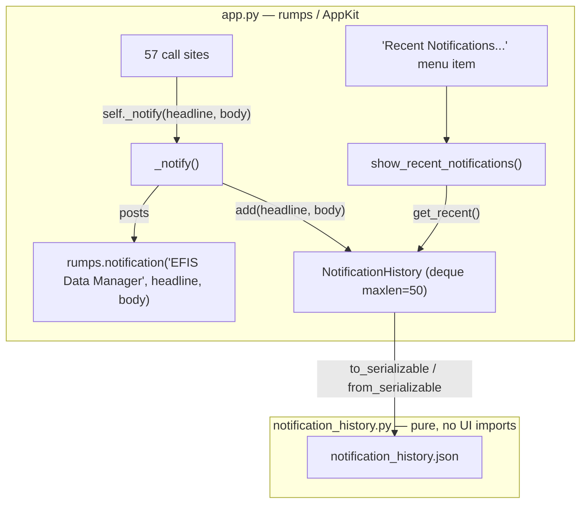

# Design Document: Notifications History

## Overview

The menu-bar app posts 57 macOS notifications from scattered call sites in
`src/efis_data_manager/app.py`, all via `rumps.notification("EFIS Data Manager",
headline, body)`. These notices auto-dismiss and cannot be reviewed afterward.

This feature adds a bounded, most-recent-first **notification history** that
captures every notification the app posts (title, message, local-time
timestamp), reviewable from the menu bar via a new "Recent Notifications..."
item. Capture is centralized through a single `self._notify(title, message)`
helper so no call site is missed: the 57 direct `rumps.notification(...)` calls
are mechanically replaced with `self._notify(...)`, making `_notify` the sole
place that posts an OS notification.

The design mirrors the existing `RecentErrorHandler` pattern (a
`collections.deque(maxlen=...)` ring buffer, local-time timestamps,
most-recent-first review, empty-state message) but is broader in scope: it
captures **all** severities (INFO included), not just WARNING+.

The core buffer logic is isolated in a new pure module,
`src/efis_data_manager/notification_history.py`, that imports nothing from
`rumps`/`AppKit`. This is the key design decision — see Architecture — so the
buffer is fully property-testable in a headless test environment. `app.py`
owns one instance of that class and wires it into `_notify` and the menu.

Scope tiers, per requirements:
- **Required core:** in-memory capture + menu-bar review (Requirements 1, 2, 3, 5).
- **Should/optional:** JSON persistence across restart (Requirement 6) — designed here.
- **Deferred/secondary:** dashboard surface (Requirement 4) — noted, not designed.

## Architecture

### Placement decision: separate pure module vs. a class in app.py

`app.py` imports `rumps` at module top level (line 23) and, transitively,
`AppKit`. Importing `app.py` in a headless CI/test runner is fragile — it pulls
in the macOS UI stack. The existing `RecentErrorHandler` lives in `app.py`
because it is a `logging.Handler` bound into `logging.basicConfig`, but its
buffer logic is trivial and untested.

For this feature the buffer logic is richer (cap enforcement, ordering,
serialize/deserialize round-trip, robust load) and warrants property tests. To
keep those tests importable **without** `rumps`/`AppKit`, the pure buffer is
placed in its own module, `notification_history.py`, containing a standalone
`NotificationHistory` class with no UI imports. `app.py` imports and owns one
instance.

Trade-off: a tiny class inside `app.py` would be marginally less code, but it
would be untestable headless. A separate module is a few lines more but makes
the entire correctness surface testable in isolation — the better trade for a
feature whose value is "nothing is missed."



Data flow:
1. Any event calls `self._notify(headline, body)`.
2. `_notify` posts `rumps.notification("EFIS Data Manager", headline, body)`
   (identical to today) and calls `self._history.add(headline, body)`.
3. `add` appends `{title, message, timestamp}`, enforces the cap of 50, and
   (if persistence enabled) writes the serialized history to disk.
4. The menu handler renders `self._history.get_recent()` in a `rumps.alert`.

## Components and Interfaces

### `notification_history.py` — pure buffer (new module)

```python
CAP = 50  # History_Cap

class NotificationEntry:
    """A recorded notification: title (headline), message (body),
    timestamp (local-time capture, formatted 'YYYY-MM-DD HH:MM:SS')."""
    title: str
    message: str
    timestamp: str  # preformatted local-time string

class NotificationHistory:
    def __init__(self, cap: int = CAP) -> None: ...

    def add(self, title, message, when=None) -> None:
        """Append an entry for (title, message). `when` is an optional
        datetime (defaults to datetime.now(), local time) used to build the
        'YYYY-MM-DD HH:MM:SS' timestamp. Non-string title/message are coerced
        with str(). Oldest entry is discarded once cap is exceeded."""

    def get_recent(self) -> list[NotificationEntry]:
        """Return entries most-recent-first (newest at index 0)."""

    def to_serializable(self) -> list[dict]:
        """Return a JSON-ready list of {title, message, timestamp} dicts, in
        most-recent-first order, at most `cap` items."""

    @classmethod
    def from_serializable(cls, data, cap: int = CAP) -> "NotificationHistory":
        """Build a history from a serialized list (most-recent-first). Tolerant:
        non-list input, or malformed items, yield a valid (possibly empty)
        history; never raises. Re-applies the cap (keeps the newest `cap`)."""
```

Internal storage uses `collections.deque(maxlen=cap)` in **insertion order**
(oldest at left, newest at right), mirroring `RecentErrorHandler`. `get_recent()`
returns `list(reversed(self._entries))` so callers get newest-first without the
buffer having to store reversed. `from_serializable` receives newest-first data
and re-appends in oldest-first order so the deque's `maxlen` eviction keeps the
newest `cap` when the input is over-length.

### `app.py` additions

```python
def _notify(self, title, message):
    """Single path for all notifications. Posts the OS notification exactly as
    before and records it in the history (Req 1.1, 1.2)."""
    rumps.notification("EFIS Data Manager", title, message)
    self._history.add(title, message)
    if PERSIST:                      # Req 6 (optional tier)
        self._save_history()

@rumps.clicked("Recent Notifications...")
def show_recent_notifications(self, _):
    """Mirror of show_recent_errors, over the notification history (Req 3)."""
    entries = self._history.get_recent()
    if not entries:
        rumps.alert(
            title="Recent Notifications",
            message="No notifications have been recorded this session.",
            ok="OK",
        )
        return
    body = "\n\n".join(_format_entry_line(e) for e in entries)  # already newest-first
    rumps.alert(title=f"Recent Notifications ({len(entries)})", message=body, ok="OK")
```

Line formatting helper (pure, in `notification_history.py` so it is testable):

```python
def format_entry_line(entry) -> str:
    """'YYYY-MM-DD HH:MM:SS — title — message' (Req 3.3, 5.3)."""
    return f"{entry.timestamp} — {entry.title} — {entry.message}"
```

`__init__` wiring:
- Instantiate `self._history = NotificationHistory()` (loading from disk first if
  persistence enabled: `self._history = self._load_history()`).
- Insert `"Recent Notifications..."` into the `self.menu` list immediately
  **before** `"Recent Errors..."` (so the two review surfaces sit together in
  the Diagnostics group). No `set_callback(None)` — it is clickable, bound via
  the `@rumps.clicked` decorator like `show_recent_errors`.

### Mapping `_notify` to `rumps.notification`'s three arguments

Today every call is `rumps.notification("EFIS Data Manager", headline, body)`
— arg1 is the constant title, arg2 the subtitle (headline), arg3 the message
(body). The requirements model an entry as `{title, message}`. The mapping:

| `_notify` param | rumps arg | history field |
|---|---|---|
| `title` (the headline) | subtitle (arg2) | `title` |
| `message` (the body)   | message (arg3) | `message` |
| — (constant)           | title (arg1) = `"EFIS Data Manager"` | not stored (redundant) |

So `self._notify(headline, body)` posts
`rumps.notification("EFIS Data Manager", headline, body)` and records
`{title: headline, message: body, timestamp: now}`. The constant app title is
not stored because it is identical for every entry; the stored `title` is the
per-notice headline, which is what the review surface needs to show.

### Mechanical replacement of the 57 call sites

Each existing call has the shape:

```python
rumps.notification("EFIS Data Manager", <headline>, <body>)
```

is replaced by:

```python
self._notify(<headline>, <body>)
```

`<headline>` and `<body>` (including multi-line f-strings and `str(e)[:100]`
truncations) are carried over verbatim, so message text is unchanged (Req 1.5 —
the app's own `[:100]` truncations are part of the message the user already sees;
the history stores whatever string is passed, without adding truncation). After
replacement, exactly one `rumps.notification(` call remains in `app.py` — the one
inside `_notify` — which is the enforcement point for Req 1.3.

All 57 sites are inside `EFISDataManagerApp` methods where `self` is in scope, so
`self._notify(...)` is always valid. (The `rumps.alert(...)` calls in
`show_recent_errors`, diagnostics, and about are unrelated and untouched.)

## Data Models

### Notification_Entry (in memory)

| Field | Type | Notes |
|---|---|---|
| `title` | `str` | The notice headline (rumps subtitle arg). |
| `message` | `str` | The body text (rumps message arg). |
| `timestamp` | `str` | Local-time capture, formatted `YYYY-MM-DD HH:MM:SS`. |

Stored preformatted (like `RecentErrorHandler`, which stores fully formatted
strings) so the review surface does no time math.

### JSON persistence shape (Requirement 6, optional tier)

File: `~/Library/Application Support/EFISDataManager/notification_history.json`
(directory is `config.APP_SUPPORT_DIR`, already created by `config.ensure_dirs()`).

A single JSON array, most-recent-first, at most 50 items:

```json
[
  {"title": "Charts Current", "message": "All 4 chart data sets are up to date.", "timestamp": "2026-09-09 14:32:07"},
  {"title": "EFIS Drive Ejected", "message": "Drive removed safely.", "timestamp": "2026-09-09 14:30:55"}
]
```

- **Cap:** `History_Cap = 50`. Enforced by `deque(maxlen=50)` in memory and by
  `to_serializable()` emitting at most 50 (Req 2.1, 6.4).
- Written by `_save_history()` on each `add` when persistence is enabled (Req 6.1).
- Read by `_load_history()` on launch; missing/corrupt → empty history (Req 6.2, 6.3).

## Correctness Properties

*A property is a characteristic or behavior that should hold true across all
valid executions of a system — essentially, a formal statement about what the
system should do. Properties serve as the bridge between human-readable
specifications and machine-verifiable correctness guarantees.*

These properties apply to the pure `NotificationHistory` buffer in
`notification_history.py`, which is fully testable without `rumps`/`AppKit`.
(UI wiring — `_notify` posting, menu rendering, empty state — is covered by
example tests in the Testing Strategy, not by properties.)

### Property 1: Add preserves title and message without truncation

*For any* pair of strings `title` and `message`, after `add(title, message)` the
most-recent entry returned by `get_recent()` has `title` and `message` exactly
equal to the inputs (no truncation, no mutation).

**Validates: Requirements 1.5, 1.4**

### Property 2: Bounded cap

*For any* sequence of `N` `add` calls, `len(get_recent())` equals `min(N, 50)`
and never exceeds the History_Cap of 50.

**Validates: Requirements 2.1**

### Property 3: FIFO eviction retains the newest 50 in order

*For any* sequence of `N > 50` distinguishable `add` calls, the retained entries
are exactly the last 50 inserted, and `get_recent()` returns them most-recent-first
(i.e. the reverse of the last 50 inserted); the first `N − 50` are absent.

**Validates: Requirements 2.2, 2.3**

### Property 4: Most-recent-first ordering

*For any* sequence of `add` calls (within the cap), `get_recent()` returns the
entries in reverse insertion order — the most-recently-added entry first.

**Validates: Requirements 5.1, 3.2**

### Property 5: Serialize/deserialize round-trip preserves entries, order, and cap

*For any* `NotificationHistory`, `from_serializable(to_serializable(h))` yields a
history whose `get_recent()` returns the same entries in the same
most-recent-first order as `h`, capped at 50.

**Validates: Requirements 6.1, 6.2, 6.4**

### Property 6: Robust load never raises

*For any* input value (arbitrary text, malformed JSON structures, wrong-typed
items, or a valid list), `from_serializable(input)` never raises and returns a
valid `NotificationHistory` — empty when the input is not a list of well-formed
entries.

**Validates: Requirements 6.3**

## Error Handling

- **Missing persistence file:** `_load_history()` returns an empty history and
  the app continues (Req 6.3). No file is treated as "no prior history."
- **Corrupt / invalid JSON:** `_load_history()` catches `json.JSONDecodeError`
  and `OSError` (mirroring `config.load_config()`), then falls back to an empty
  history. `from_serializable` additionally tolerates a successfully-parsed but
  wrong-shaped value (non-list, or list with malformed items) by skipping bad
  items — never raising (Property 6).
- **Non-string `title`/`message`:** `add` coerces with `str(...)` so a stray
  non-string argument cannot crash capture. (All 57 current call sites already
  pass strings, so this is defensive only.)
- **Save failure:** `_save_history()` wraps the write in try/except and logs a
  warning on `OSError`; a failed persist never interrupts the notification path
  (the OS notification has already posted and the in-memory history is intact).
- **Capture must never break posting:** in `_notify`, recording/persisting is
  best-effort; a failure there is logged but does not prevent (or follow before)
  the `rumps.notification` call, so notifications behave exactly as today even if
  history handling fails.

## Testing Strategy

### Property-based tests (pure buffer) — Hypothesis

`Hypothesis` is already in `requirements.txt` and used elsewhere (see
`.hypothesis/`). Each correctness property maps to exactly **one** property test
in a new `tests/test_notification_history.py`, importing only
`notification_history` (no `rumps`/`AppKit`), so they run headless.

- Minimum 100 iterations per property (Hypothesis default `max_examples` ≥ 100).
- Each test tagged with a comment: `# Feature: notifications-history, Property N: <text>`.
- Generators: `st.text()` for titles/messages (covering empty, whitespace,
  unicode, long strings — exercising Req 1.5 edge cases); `st.lists(...)` of
  entries for sequence properties; for Property 6, a broad strategy including
  `st.text()`, `st.none()`, `st.integers()`, `st.dictionaries(...)`, and lists of
  malformed dicts.

| Property | Test focus |
|---|---|
| P1 | `add` then `get_recent()[0]` equals inputs exactly |
| P2 | `len(get_recent()) == min(N, 50)` |
| P3 | over-cap sequence → newest-50, newest-first; oldest evicted |
| P4 | `get_recent()` == reversed insertion order |
| P5 | `from_serializable(to_serializable(h))` preserves entries/order/cap |
| P6 | arbitrary/corrupt input → no raise, valid (empty) history |

### Example / unit tests

- **`_notify` records + posts (Req 1.1, 1.2):** with `rumps.notification`
  monkeypatched to a mock, call `_notify(headline, body)`; assert the mock was
  called once with `("EFIS Data Manager", headline, body)` and that the history
  now holds one entry `{title: headline, message: body}`. (Requires constructing
  or partially mocking the app; if importing `app.py` headless is impractical,
  test the recording contract directly against `NotificationHistory` and the
  documented mapping.)
- **INFO severity captured (Req 1.4):** add an INFO-style notice and confirm it
  is retained (the buffer applies no severity filter, unlike `RecentErrorHandler`).
- **Menu handler formatting (Req 3.2, 3.3):** unit test `format_entry_line` — for
  a known entry the line contains the timestamp, title, and message, separated as
  designed; and that the handler joins lines in `get_recent()` (newest-first) order.
- **Empty state (Req 3.4, 5.4):** with an empty history, the handler produces the
  empty-state message, not a blank body.
- **Timestamp format (Req 5.2, 5.3):** `add(when=<known datetime>)` yields a
  timestamp string matching `YYYY-MM-DD HH:MM:SS` for that local time (thin
  wrapper over `strftime`, verified by example rather than a low-value property).
- **Persistence I/O (Req 6.1, 6.2, 6.3):** using a temp file path — after adds
  the file contains the same entries as `get_recent()` (≤ 50); loading that file
  reconstructs the same history; a missing file and a file with invalid JSON both
  load to an empty history without error.

### Call-site replacement verification (Req 1.3)

A lightweight static test asserts that `_notify` is the only caller of
`rumps.notification`: read `src/efis_data_manager/app.py` and assert the count of
`rumps.notification(` occurrences is exactly 1. This guarantees no direct call
site was missed by the mechanical replacement and that all posting is centralized.

### Why not property-test the UI/persistence I/O layer

`_notify` posting, menu rendering, timestamp formatting, and file I/O are wiring
/ side-effect concerns whose behavior does not vary meaningfully across a large
input space — example and integration tests fit them better. Property tests are
reserved for the pure buffer logic (ordering, cap, round-trip), where input
variation across 100+ iterations genuinely finds edge cases.

### Deferred: dashboard surface (Requirement 4)

The optional dashboard notification-history surface is **deferred** and not
designed here. When implemented it would render `NotificationHistory.get_recent()`
(most-recent-first, title/message/timestamp) on the Alerts page and must leave the
existing `/api/alerts` anomaly computation unchanged (Req 4.2). No design detail
is committed at this time.
