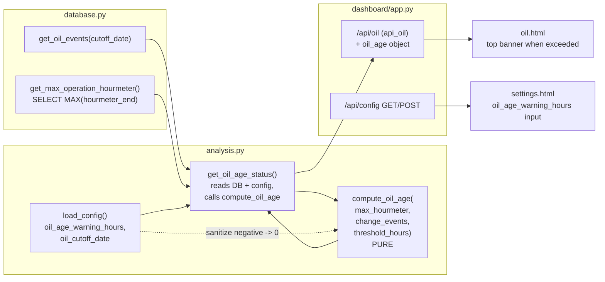

# Design Document

## Overview

The GRT EFIS tracks internal oil hours (`STID_OIL_HOURS`) but this pilot never
resets that counter at an oil change, so it is stale and per-drive. The
dashboard, however, already records every oil-change event (with the engine
hourmeter at the change) and the `hourmeter_end` of every operation. That is
enough to compute oil age independently, from dashboard data alone.

This feature adds a small, self-contained capability:

1. A new config key `oil_age_warning_hours` (a threshold in engine hours;
   `0` = disabled).
2. A pure arithmetic core plus a thin DB-reading wrapper in `analysis.py` that
   compute "oil hours since the most recent oil change" and classify it into a
   small status object.
3. An extension of the EXISTING `/api/oil` response with an `oil_age` object
   (no new route — `oil.html` already fetches `/api/oil`).
4. A prominent banner at the top of the oil page when the threshold is exceeded,
   omitted entirely otherwise.
5. A Settings-page input for `oil_age_warning_hours`, wired through the existing
   `/api/config` GET/POST plumbing.

Reading or parsing the EFIS State counter is explicitly out of scope
(Requirement 2.4).

### Key design decisions

| Decision | Choice | Rationale |
|---|---|---|
| Where the arithmetic lives | Pure function `compute_oil_age(...)` in `analysis.py`, plus a higher-level `get_oil_age_status()` that reads the DB and calls it | The subtraction/selection/classification is the part worth property-testing. Keeping it a pure function (no DB) lets Hypothesis drive it directly, matching how `analysis.py` already separates pure helpers (`compute_oil_consumption_rolling`) from DB reads. The thin `get_oil_age_status()` wrapper does the I/O so the route stays a one-liner. |
| Both a pure fn AND a wrapper (vs one DB function) | Two functions | The requirements are almost all about the arithmetic and state classification (Reqs 2, 3, 5). Those need to be tested without a database. A single DB-reading function would force every property test to build SQLite fixtures. The split is the smaller cohesive design for *testability*, at the cost of one extra function. |
| Where change-event selection lives | Inside the pure fn (it receives the list of change events and picks max-hourmeter) | Req 3 (ignore additions) and Req 2.2 / 5.2 (pick highest hourmeter) are logic, not I/O. Passing the raw change-event list in keeps that logic property-testable; the wrapper only supplies the already-cutoff-filtered events. |
| Current engine hours source | `MAX(hourmeter_end)` over `operations` via a new tiny DB helper `get_max_operation_hourmeter()` | Req 2.1 defines Current_Engine_Hours exactly this way. No such helper exists yet; a one-line `SELECT MAX(...)` is cheaper and clearer than loading all operations. |
| Cutoff handling | Reuse `get_oil_events(cutoff_date=...)`, exactly as `get_oil_changes()` already does | Req 2.7 / 2.8 are already implemented by that query's `date >= cutoff` filter; no new cutoff logic. |
| New route vs extend `/api/oil` | Extend `/api/oil` with an `oil_age` key | `oil.html` already calls `/api/oil` on load; a new route would mean a second fetch. Explicitly required by the task. |
| Banner rendering | Client-side in `oil.html`, top of page, only when `status == "exceeded"` | Reqs 4.1–4.6: show only when exceeded; omit (no zero/placeholder) otherwise. The page is already fully client-rendered from `/api/oil`. |
| Negative-hours handling | Pure fn returns `limit_exceeded = False` when hours < 0 | Req 5.1: a rolled-back hourmeter must not raise a false warning. |
| Boundary at exactly threshold | `>` (strictly greater), so equal is NOT exceeded | Reqs 4.1 / 4.3 say "greater than" and "less than or equal to … omit". |

## Architecture



The pure `compute_oil_age()` sits at the bottom with no I/O. `get_oil_age_status()`
gathers inputs (config threshold, cutoff-filtered change events, max operation
hourmeter) and delegates the arithmetic and classification to it. The route calls
`get_oil_age_status()` and drops the result into the existing JSON.

## Components and Interfaces

### `database.py` — new helper

```python
def get_max_operation_hourmeter() -> Optional[float]:
    """Return the maximum non-null hourmeter_end across all operations.

    This is Current_Engine_Hours (Req 2.1): the most recent known engine time.
    Returns None when no operation has a non-null hourmeter_end (Req 2.6):

        SELECT MAX(hourmeter_end) FROM operations
    """
```

`MAX(...)` in SQLite ignores NULLs and yields `NULL` (→ Python `None`) when no
non-null row exists, which is exactly the "not computable" input.

### `analysis.py` — pure compute core

```python
def compute_oil_age(
    operations_max_hourmeter: Optional[float],
    oil_change_events: list[dict],
    threshold_hours: float,
) -> dict:
    """Classify oil age from dashboard data. PURE — no DB, no config, no I/O.

    Args:
        operations_max_hourmeter: Current_Engine_Hours (max hourmeter_end), or
            None when no operation has a non-null hourmeter_end (Req 2.1, 2.6).
        oil_change_events: oil-change events already filtered by cutoff date.
            Only events with event_type == "change" are considered; any others
            are ignored (Req 3.1, 3.2). Each considered event must carry a
            numeric "hourmeter". The list need not be sorted.
        threshold_hours: oil_age_warning_hours, already sanitized to >= 0.
            <= 0 means the warning is disabled (Req 1.3, 1.4, 4.5).

    Returns a status dict (see Data Models):
        {
          "status": "ok" | "exceeded" | "no_change_on_record" | "not_computable",
          "oil_hours_since_change": float | None,
          "threshold": float,
          "limit_exceeded": bool,
        }

    Classification (in order):
      1. threshold_hours <= 0            -> status "ok", hours None,
                                            limit_exceeded False (disabled;
                                            Req 1.3, 4.5). No banner.
      2. no change event with type
         "change" among oil_change_events -> "no_change_on_record",
                                            hours None (Req 2.5).
      3. operations_max_hourmeter is None -> "not_computable", hours None
                                            (Req 2.6).
      4. otherwise: recent = max hourmeter among "change" events (Req 2.2, 5.2);
         hours = operations_max_hourmeter - recent (Req 2.3);
           - hours <= 0 (rolled-back/out-of-order): "ok",
             hours reported, limit_exceeded False (Req 5.1);
           - 0 < hours <= threshold: "ok", limit_exceeded False (Req 4.3);
           - hours > threshold: "exceeded", limit_exceeded True (Req 4.1).

    "threshold" in the returned dict is always the sanitized threshold_hours.
    """
```

Note on ordering: the disabled check (step 1) comes first so that a disabled
threshold never does work or leaks a state that could render a banner. Steps 2
and 3 are both "not enough data" cases but the requirements name them
distinctly (`no_change_on_record` vs `not_computable`), so they stay separate.

### `analysis.py` — DB/config wrapper

```python
def get_oil_age_status() -> dict:
    """Compute the oil-age status from live dashboard data (Req 2, 3, 5).

    Reads oil_age_warning_hours and oil_cutoff_date from config, loads
    cutoff-filtered oil events via database.get_oil_events(cutoff_date=...),
    reads Current_Engine_Hours via database.get_max_operation_hourmeter(), then
    delegates to compute_oil_age(). Sanitizes a negative/absent
    oil_age_warning_hours to 0 (Req 1.2, 1.4) before passing it in.

    Returns the same status dict shape as compute_oil_age().
    """
```

Threshold sanitization detail (Req 1.2, 1.4): read
`config.get("oil_age_warning_hours", 0)`, coerce to `float`, and if it is
negative (or non-numeric) treat it as `0`. This is done in the wrapper (which
owns config) so the pure function can assume a clean `>= 0` threshold — but the
pure function's own `<= 0` disabled branch still guards it defensively.

### `dashboard/app.py` — extend `api_oil`

The existing route gains one key. No behavior change to the other keys:

```python
@app.route("/api/oil")
def api_oil():
    config = load_config()
    window = config.get("trend_window_hours", 25)
    from efis_data_manager.analysis import get_oil_changes, get_oil_age_status
    from efis_data_manager.database import get_oil_events
    cutoff = config.get("oil_cutoff_date", "")
    return jsonify({
        "consumption": compute_oil_consumption_rolling(window),
        "changes": get_oil_changes(),
        "events": get_oil_events(cutoff_date=cutoff),
        "cutoff_date": cutoff,
        "oil_age": get_oil_age_status(),   # NEW
    })
```

### `oil.html` — top banner

- Add an empty banner container at the very top of the content block, before
  `<h1>Oil Consumption</h1>`:

  ```html
  <div id="oil-age-banner" style="display:none;"></div>
  ```

- In `loadOil()`, after receiving `data`, render the banner from
  `data.oil_age`:

  ```js
  const age = data.oil_age;
  const banner = document.getElementById('oil-age-banner');
  if (age && age.status === 'exceeded') {
      banner.className = 'note';           // reuse existing note styling …
      banner.style.display = '';
      banner.style.color = '#ef5350';      // … recolored to a warning red
      banner.style.borderColor = '#ef5350';
      banner.style.borderLeftColor = '#ef5350';
      banner.textContent =
          `Oil age threshold exceeded: ${age.oil_hours_since_change.toFixed(1)}` +
          ` oil hours since last change (limit ${age.threshold})`;
  } else {
      banner.style.display = 'none';
      banner.textContent = '';
  }
  ```

  This reuses the existing `.note` block style (defined in `base.html`) and the
  warning-red pattern already used on the settings page
  (`color:#ef5350; border-color:#ef5350`), so the banner matches the page's
  look. It is shown ONLY when `status === "exceeded"` (Req 4.1) and is otherwise
  hidden with no placeholder (Reqs 4.3–4.5), leaving the rest of the oil content
  untouched (Req 4.6).

### `settings.html` — threshold input

- Add a numeric input inside the existing "Dashboard" card, next to
  `trend_window_hours` (which is the established pattern for a plain numeric
  config field):

  ```html
  <div class="form-row">
      <label>Oil Age Warning (hours)<span class="help" tabindex="-1">?<span class="tip">Show a banner on the Oil page when engine hours since your most recent oil change exceed this. Computed from your oil-change events and operation hourmeters. 0 disables the warning. Many operators use ~40–50 hours; the default is 0 so nothing changes until you set it.</span></span></label>
      <input type="number" id="oil_age_warning_hours" min="0" step="1">
  </div>
  ```

- On config load (the existing `fetch('/api/config')` block), populate it:

  ```js
  document.getElementById('oil_age_warning_hours').value =
      config.oil_age_warning_hours ?? 0;
  ```

- In `saveSettings()`, add it to the posted `config` object, clamping a negative
  or blank value to 0 client-side (server also sanitizes):

  ```js
  oil_age_warning_hours: Math.max(0, parseFloat(
      document.getElementById('oil_age_warning_hours').value) || 0),
  ```

This flows through the existing `/api/config` POST → `config.update()` →
`save_config()` path (Req 1.5, 1.6). No new endpoint.

## Data Models

### Config key (Req 1)

Add to `DEFAULT_CONFIG` in `config.py`:

```python
    # Oil-age warning: show a banner on the Oil page when engine hours since the
    # most recent oil change exceed this many hours. 0 disables it (the default,
    # so existing installs are unaffected until the user opts in). Recommended
    # ~40-50h. A negative value is treated as 0 (disabled).
    "oil_age_warning_hours": 0,
```

Default `0` means the feature is off for existing users until they set it
(Reqs 1.2, 1.3). Because `load_config()` merges saved config over
`DEFAULT_CONFIG`, an upgrade with no stored value picks up `0` automatically
(Req 1.2). Negative sanitization happens in `get_oil_age_status()` /
client-side, not in the default.

### Oil-age status object (the `oil_age` value in `/api/oil`)

```jsonc
{
  "status": "ok" | "exceeded" | "no_change_on_record" | "not_computable",
  "oil_hours_since_change": 47.3,   // float, or null
  "threshold": 45,                   // sanitized oil_age_warning_hours (>= 0)
  "limit_exceeded": true             // bool; true only when status == "exceeded"
}
```

State semantics:

| status | meaning | oil_hours_since_change | limit_exceeded | banner |
|---|---|---|---|---|
| `ok` | disabled, OR computable and within limit (incl. negative hours) | `null` (disabled) or a float | `false` | omitted |
| `exceeded` | computable and strictly over the threshold | float `> threshold` | `true` | shown |
| `no_change_on_record` | no oil-change event passes the cutoff (Req 2.5) | `null` | `false` | omitted |
| `not_computable` | no operation has a non-null hourmeter_end (Req 2.6) | `null` | `false` | omitted |

`limit_exceeded` is redundant with `status == "exceeded"` but is included as an
explicit boolean the client can key off without string comparison; the two are
always consistent by construction.

### No schema change

Oil age is computed on the fly from the existing `oil_events` and `operations`
tables. There is no new table, column, or cached value — consistent with how the
rest of the oil analysis recomputes from raw rows.

## Correctness Properties

*A property is a characteristic or behavior that should hold true across all
valid executions of a system — essentially, a formal statement about what the
system should do. Properties serve as the bridge between human-readable
specifications and machine-verifiable correctness guarantees.*

These properties target the pure `compute_oil_age(operations_max_hourmeter,
oil_change_events, threshold_hours)` function, which is where all the age
arithmetic and state classification lives. The DB read (`MAX(hourmeter_end)`),
the config sanitization, the cutoff SQL filter, the settings-page input, and the
banner wording are validated by example/integration tests instead (see Testing
Strategy) because they exercise SQLite/Flask/DOM behavior that does not vary
meaningfully with generated input.

Redundancy reflection (performed before writing the properties):

- Requirements 2.2, 2.3, and 5.2 are one statement — when computable, the age is
  `max_hourmeter − (highest-hourmeter change)`, so earlier changes are ignored.
  Consolidated into Property 1.
- Requirements 3.1 and 3.2 both say additions must not affect selection.
  Consolidated into Property 2.
- Requirements 2.5, 2.6, and 4.4 are the "missing data" states
  (`no_change_on_record`, `not_computable`) that produce no numeric value and no
  banner. Consolidated into Property 3.
- Requirements 1.3 and 4.5 both say a threshold of `0` disables the warning; the
  pure function generalizes this to `threshold <= 0`. Consolidated into
  Property 4.
- Requirements 4.1 and 4.3 are the two sides of one boundary: exceeded iff
  `hours > threshold`, so exactly-at-threshold is NOT exceeded. Consolidated
  into Property 5.
- Requirement 5.1 (negative hours ⇒ not exceeded) is kept as its own Property 6
  for clarity even though it also follows from Property 5's `hours > threshold`
  gate.

### Property 1: Age is current hours minus the highest-hourmeter change

*For any* `operations_max_hourmeter` that is a finite number, *for any*
non-empty list of oil-change events (`event_type == "change"`) with numeric
hourmeters whose maximum `H` satisfies `operations_max_hourmeter - H > 0`, and
*for any* `threshold_hours >= 0`: `compute_oil_age(...)["oil_hours_since_change"]`
equals `operations_max_hourmeter - H`, where `H` is the maximum hourmeter among
the change events; adding further change events with hourmeter `< H` does not
change the result.

**Validates: Requirements 2.2, 2.3, 5.2**

### Property 2: Oil additions are ignored

*For any* inputs, `compute_oil_age(max_hm, events, threshold)` returns a result
equal to `compute_oil_age(max_hm, [e for e in events if e["event_type"] ==
"change"], threshold)`. In particular, inserting any number of non-`"change"`
events (with arbitrary hourmeters, including very large ones) into the event
list leaves `status`, `oil_hours_since_change`, and `limit_exceeded` unchanged.

**Validates: Requirements 3.1, 3.2**

### Property 3: Missing-data states produce no number and no warning

*For any* `threshold_hours > 0`: (a) if no event in `oil_change_events` has
`event_type == "change"`, then `status == "no_change_on_record"`; and (b) if at
least one `"change"` event exists but `operations_max_hourmeter is None`, then
`status == "not_computable"`. In both cases `oil_hours_since_change is None` and
`limit_exceeded is False` (so no banner is ever shown).

**Validates: Requirements 2.5, 2.6, 4.4**

### Property 4: A non-positive threshold disables the warning

*For any* `operations_max_hourmeter` and *for any* list of oil-change events,
when `threshold_hours <= 0` the result has `limit_exceeded is False` and
`status != "exceeded"` (the warning is disabled regardless of the data).

**Validates: Requirements 1.3, 4.5**

### Property 5: Exceeded iff hours strictly greater than threshold

*For any* finite `operations_max_hourmeter`, non-empty `"change"` event list
with maximum hourmeter `H` such that `hours = operations_max_hourmeter - H > 0`,
and *for any* `threshold_hours > 0`: `limit_exceeded is True` and
`status == "exceeded"` if and only if `hours > threshold_hours`. When
`hours == threshold_hours` (the boundary) the result is NOT exceeded
(`status == "ok"`, `limit_exceeded is False`), consistent with the spec's
"greater than" / "less than or equal to … omit" wording.

**Validates: Requirements 4.1, 4.3**

### Property 6: Negative age never raises a warning

*For any* finite `operations_max_hourmeter`, non-empty `"change"` event list
whose maximum hourmeter `H` satisfies `operations_max_hourmeter - H <= 0`
(a rolled-back or out-of-order hourmeter), and *for any* `threshold_hours > 0`:
the result has `status == "ok"` and `limit_exceeded is False`, even when the
magnitude of the negative age exceeds `threshold_hours`.

**Validates: Requirements 5.1**

## Error Handling

- **No oil-change events (after cutoff).** `compute_oil_age` returns
  `status == "no_change_on_record"`, `oil_hours_since_change = None`. The route
  still returns valid JSON; the banner is omitted (Req 2.5, 4.4).
- **No operation hourmeter.** `get_max_operation_hourmeter()` returns `None`
  (empty table or all `hourmeter_end` NULL). `compute_oil_age` returns
  `status == "not_computable"`, hours `None`; banner omitted (Req 2.6, 4.4).
- **Rolled-back / out-of-order hourmeter (negative age).** Age is reported as-is
  but classified `"ok"` with `limit_exceeded = False`, so no false warning
  (Req 5.1). The negative number is not surfaced in a banner (banner only shows
  on `"exceeded"`).
- **Negative / non-numeric `oil_age_warning_hours` in config.**
  `get_oil_age_status()` coerces to `float` and clamps to `0`; a non-numeric
  value (corrupt config) is treated as `0` (disabled) rather than raising
  (Req 1.4). The pure function's `threshold <= 0` branch is a second line of
  defense.
- **Additions with anomalous hourmeters.** Non-`"change"` events are filtered
  out before selection, so a top-up recorded with a spurious hourmeter cannot
  affect the age (Req 3.1, 3.2).
- **Disabled feature (default).** With `oil_age_warning_hours == 0` (the
  shipped default), `compute_oil_age` returns `status == "ok"`, hours `None`,
  and does no change-selection work; existing installs see no change until they
  opt in (Req 1.2, 1.3).
- **Client rendering.** `oil.html` reads `data.oil_age` defensively (guards for
  a missing object) and only renders the banner when
  `status === "exceeded"`; every other state hides the banner with no
  placeholder text (Req 4.3–4.5).

## Testing Strategy

### Dual approach

- **Property tests (Hypothesis)** cover the pure `compute_oil_age` universals:
  age arithmetic and most-recent selection, additions ignored, missing-data
  classification, disabled threshold, the exceeded boundary, and negative-age
  handling (Properties 1–6).
- **Example / unit tests** pin concrete states of `compute_oil_age` and the
  config default/sanitization, and the DB helper's NULL handling.
- **Integration tests (Flask)** cover the `/api/oil` `oil_age` field wiring and
  the `/api/config` round-trip for `oil_age_warning_hours`. These are NOT
  property tests: they exercise SQLite/Flask behavior that does not vary
  meaningfully with generated input.

### Property-based testing setup

- Library: **Hypothesis** (already in `requirements.txt`). Do NOT hand-roll
  random testing.
- Each property test runs **≥ 100 iterations** (Hypothesis default
  `max_examples = 100`; set `@settings(max_examples=100)` explicitly where it
  aids clarity).
- Each property test carries a comment tag referencing its design property:
  `# Feature: oil-age-warning, Property N: <property text>`.
- Each of Properties 1–6 is implemented by a **single** property-based test.

Generators:

- **Change events:** `st.lists` of dicts `{"event_type": "change", "date":
  <YYYY-MM-DD str>, "hourmeter": <finite float>}`. For most-recent-selection
  tests, generate distinct hourmeters and shuffle so ordering can't be relied
  on. `date` is present for realism but unused by the pure function.
- **Addition events (Property 2):** dicts with `event_type` drawn from a set
  excluding `"change"` (e.g. `"addition"`, plus random labels) and arbitrary
  finite hourmeters, interleaved with the change events.
- **`operations_max_hourmeter`:** finite floats via
  `st.floats(allow_nan=False, allow_infinity=False)`; a separate `st.none()`
  branch for the not-computable case.
- **`threshold_hours`:** `st.floats(min_value=0, allow_nan=False,
  allow_infinity=False)`; a `<= 0` branch for the disabled property.
- **Boundary (Property 5):** construct inputs so that
  `hours = max_hm - H` lands exactly on, just below, and just above
  `threshold` (e.g. pick `H`, `threshold`, then set `max_hm = H + threshold`,
  `H + threshold - ε`, `H + threshold + ε`).
- **Negative age (Property 6):** choose `H` and set `max_hm = H - δ` for
  `δ > 0`, including `δ > threshold`.

Use `math.isclose`/tolerance where floating-point subtraction is compared, to
avoid brittle exact-equality failures on generated floats.

### Example / unit tests

- **Config default (Req 1.1, 1.2):** `DEFAULT_CONFIG["oil_age_warning_hours"]
  == 0`; a `load_config()` over a saved config lacking the key yields `0`.
- **Negative sanitization (Req 1.4):** `get_oil_age_status()` with a negative
  configured value behaves as disabled (`status "ok"`, `limit_exceeded False`),
  and the returned `threshold` is `0`.
- **`compute_oil_age` concrete states:**
  - disabled: `threshold = 0`, arbitrary data → `status "ok"`, hours `None`.
  - exceeded: `max_hm = 100`, one change at `50`, `threshold = 45` → hours
    `50.0`, `status "exceeded"`, `limit_exceeded True`.
  - at-threshold: same but `threshold = 50` → `status "ok"` (boundary).
  - no change: only addition events → `no_change_on_record`, hours `None`.
  - not computable: `max_hm = None`, one change → `not_computable`, hours
    `None`.
  - negative: `max_hm = 40`, change at `50`, `threshold = 5` → `status "ok"`,
    `limit_exceeded False`.
- **DB helper (Req 2.1, 2.6):** insert operations with a mix of numeric and
  `NULL` `hourmeter_end`; `get_max_operation_hourmeter()` returns the max; with
  no rows / all-NULL it returns `None`.
- **Cutoff passthrough (Req 2.7, 2.8):** with events on both sides of a cutoff
  date, `get_oil_age_status()` selects the most-recent change among only the
  on/after-cutoff `"change"` events (relies on the existing
  `get_oil_events(cutoff_date=...)` filter); empty cutoff includes all.

### Integration tests (Flask)

- **`/api/oil` field present (Req 2, 4):** with a seeded DB (operations +
  change events + a set `oil_age_warning_hours`), `GET /api/oil` returns an
  `oil_age` object with the expected `status`, `oil_hours_since_change`,
  `threshold`, and `limit_exceeded`; the other keys (`consumption`, `changes`,
  `events`, `cutoff_date`) are unchanged.
- **`oil_age` disabled default:** with the default config (`0`), `GET /api/oil`
  returns `oil_age.status == "ok"` and `limit_exceeded False`.
- **Config round-trip (Req 1.5, 1.6):** `POST /api/config` with
  `{"oil_age_warning_hours": 45}` then `GET /api/config` returns `45`; posting a
  negative value is stored, and `get_oil_age_status()` still treats it as
  disabled (sanitized at read time).

### UI checks (not automated PBT)

- **Banner wording (Req 4.2):** when `oil_age.status == "exceeded"`, the
  rendered banner text matches the shape "Oil age threshold exceeded: NN.N oil
  hours since last change (limit MM)" with the hours to one decimal — verified
  by inspecting the rendered DOM / a lightweight JS assertion.
- **Banner omission (Req 4.3–4.6):** for `ok` / `no_change_on_record` /
  `not_computable`, the `#oil-age-banner` element is hidden and empty, and the
  rest of the oil page renders unchanged.
- **Settings input (Req 1.5):** `settings.html` renders a non-negative numeric
  input `#oil_age_warning_hours` that loads from and saves through
  `/api/config`.

### Integration points to modify

- `config.py` (modified): add `"oil_age_warning_hours": 0` to `DEFAULT_CONFIG`.
- `database.py` (modified): add `get_max_operation_hourmeter() ->
  Optional[float]`.
- `analysis.py` (modified): add the pure `compute_oil_age(...)` and the wrapper
  `get_oil_age_status()`.
- `dashboard/app.py` `api_oil` (modified): add the `"oil_age":
  get_oil_age_status()` key to the response.
- `dashboard/templates/oil.html` (modified): add the top `#oil-age-banner`
  container and render it from `data.oil_age` in `loadOil()`.
- `dashboard/templates/settings.html` (modified): add the
  `oil_age_warning_hours` input, load it from config, and include it in the
  `saveSettings()` payload (clamped to `>= 0`).
